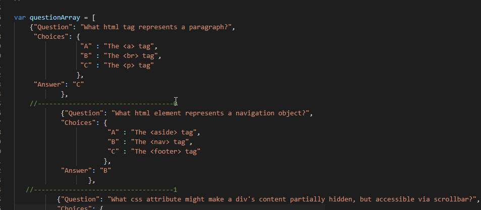
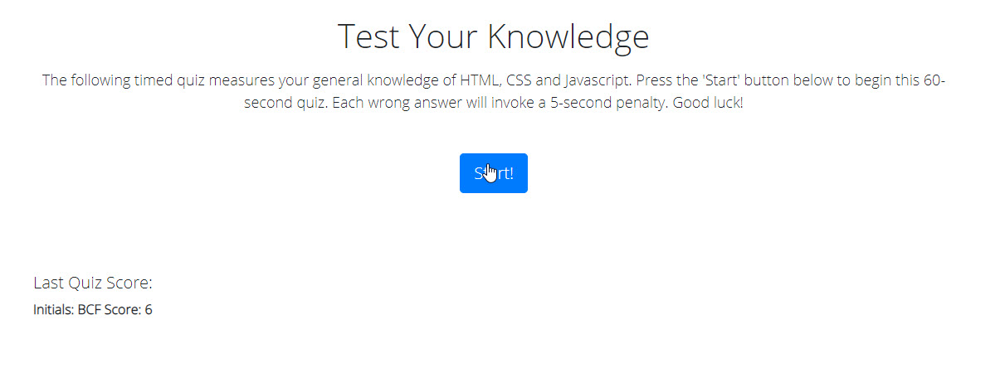
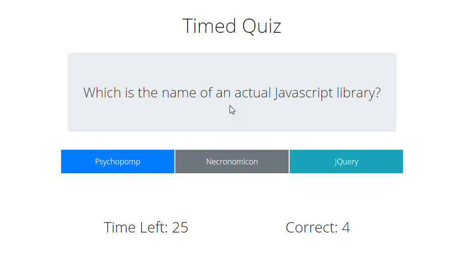
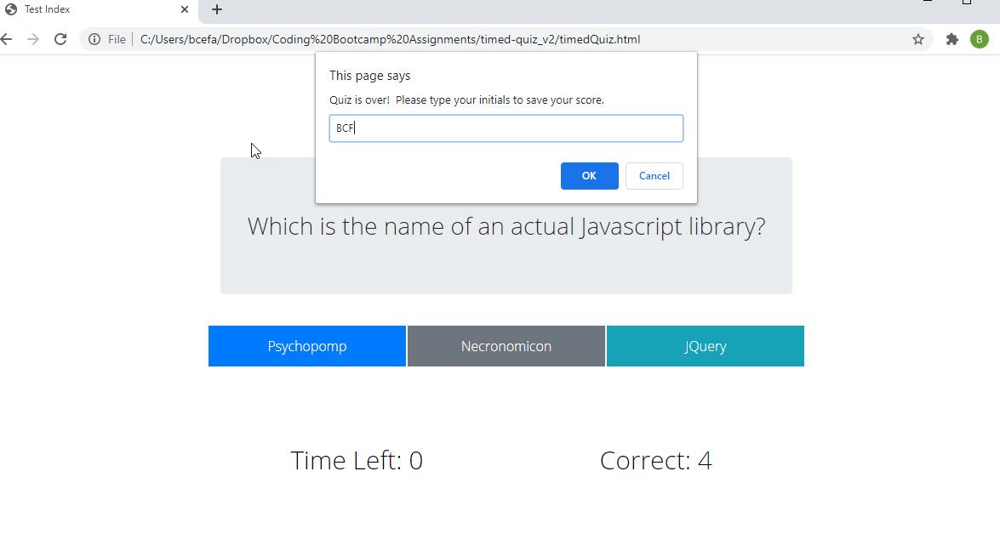

PURPOSE:
The timed-quiz app is a click-responsive test in which the user is given a time-penalty
for each wrong answer. 

#LANGUAGES USED:
HTML (Bootstrap Framework), CSS and Javascript

#METHODOLOGIES:
The simplest explanation is that this app's functionality comes from Javascript creating 
user-interactions with an array.  At each index of this array is a JSON object that repesents
a question, answer-choices, and a one-letter "definition" of the correct answer.

 

A rough sketch of the process can be described as follows:

(1) The user begins at a start screen (file: index.html) with a short explanation of the rules and a button to press to begin the quiz.  The operant JS file on this page is startPage. Beneath the Start Button, the user's last score is displayed.  This is pulled from local storage.

 

(2) On clicking the Start button, the user navigates to the actual quiz screen (file: timedQuiz.html). Here, the operant JS file is quizFunctions.js, which calls each index
of the array and turns the JSON object at each index (question, answer-choices, etc) into
actionable content on the page.

 

(3) After the user makes a choice, the question is evaluated for correctness.  If incorrect,
a time-penalty function subtracts five seconds.

(4) At the end of the quiz - whether all questions have been answered or time has ran out - the user is prompted to submit their initials and their score is stored in local storage.  After each quiz, the user is returned to the start screen.

 

